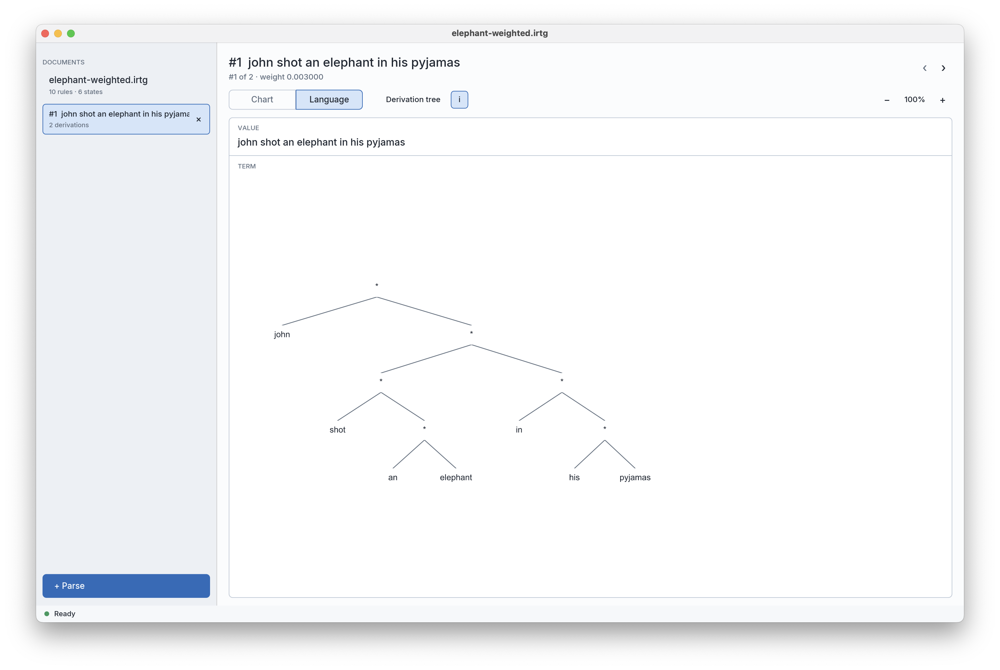
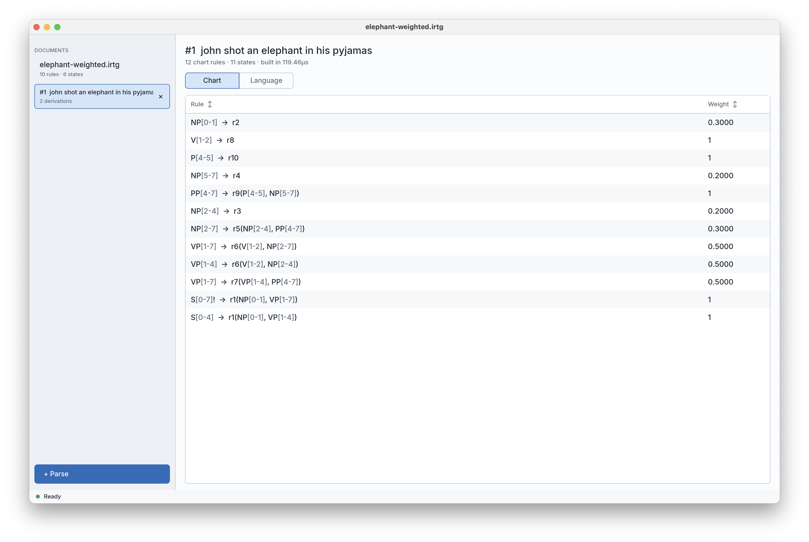
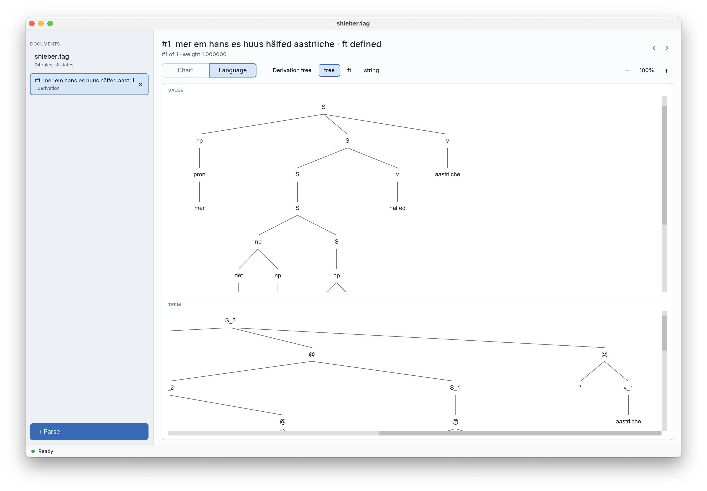

# Rusty Alto

Rusty Alto is a native desktop application for parsing with multiple grammar
formalisms. It provides one workflow for loading a grammar, supplying one or
more inputs, inspecting the parse chart, and exploring weighted derivations
across all of the grammar's interpretations.

Rather than tying its algorithms to a single formalism, Rusty Alto uses
**interpreted regular tree grammars (IRTGs)** as a common representation. This
brings formalisms such as context-free grammars, tree-adjoining grammars, and
synchronous grammars into the same parsing framework. The application
currently reads Alto-compatible IRTG files and Tulipac TAG grammars, powered by
the [`rusty-alto`](https://crates.io/crates/rusty-alto) parsing library.



## Features

- Open Alto-compatible IRTGs and Tulipac TAG grammars, and inspect their states,
  rules, weights, and interpretations.
- Parse one or more interpretation inputs using top-down condensed, indexed
  condensed, or A* parsing.
- Configure A* heuristics and stop after the first goal when the chosen inputs
  support it.
- Cancel long-running parses without closing the application.
- Inspect the resulting parse chart and sort its rules.
- Enumerate weighted derivations incrementally, including infinite languages.
- View derivation trees and evaluated interpretation values as text, trees, or
  feature structures.
- Switch between interpretations, zoom visual values, and copy values using
  the output codecs provided by `rusty-alto`.
- Drag any tree, derivation term, or feature structure straight out of the
  window to export it as a PDF (drop it into Finder, Explorer, or another
  application). Available on macOS and Windows.
- Work with multiple grammars at once, each in its own native window.

| Parse chart | Interpretation and derivation views |
| --- | --- |
|  |  |

## Download and install

Download the latest installer or standalone archive from
[GitHub Releases](https://github.com/coli-saar/rusty-alto-gui/releases/latest).

The release workflow builds:

- macOS: `.dmg` and a standalone `.tar.gz`
- Windows: `.msi` and a standalone `.zip`
- Linux x86-64: `.deb`, `.AppImage`, and a standalone `.tar.gz`

Release artifacts are currently unsigned. On first launch, macOS Gatekeeper or
Windows SmartScreen may ask you to confirm that you want to run the application.

## Getting started

1. Start Rusty Alto and choose **Open grammar**.
2. Select an IRTG file supported by the installed `rusty-alto` codecs.
3. Inspect the grammar table or switch to **Language** to browse its
   derivations.
4. Choose **+ Parse**, enter one or more interpretation inputs, select a parsing
   strategy, and start the parse.
5. Open the generated chart or switch to its **Language** view to inspect the
   resulting derivations and interpretation values.

Useful keyboard shortcuts are available from the application menu. The most
common are <kbd>Ctrl/⌘ O</kbd> to open a grammar and <kbd>Ctrl/⌘ P</kbd> to
create a parse.

## Supported platforms

- macOS 13 or newer
- Windows 10 or newer
- Current x86-64 Linux distributions

## License

Rusty Alto GUI is licensed under the [Apache License 2.0](LICENSE). The bundled
Inter font retains its own license in
[`assets/fonts/Inter-LICENSE.txt`](assets/fonts/Inter-LICENSE.txt).

---

## Maintainer guide: build and release

### Local development

Install Rust 1.88 or newer, then:

```sh
cargo run
```

The application uses `rusty-alto` 0.2.0 from crates.io; a sibling checkout of
the core library is not required.

Before committing a release, run:

```sh
cargo fmt --check
cargo test
cargo clippy --all-targets --all-features -- -D warnings
cargo build --release
```

### Build native packages locally

Install [cargo-packager](https://github.com/crabnebula-dev/cargo-packager):

```sh
cargo install cargo-packager --version 0.11.8 --locked
```

Run the command for the current operating system:

```sh
# macOS
cargo packager --release --formats app,dmg

# Windows
cargo packager --release --formats wix

# Linux
cargo packager --release --formats deb,appimage
```

Packages are written to `dist/`. Each package must be built and tested on its
native operating system.

### Create a GitHub release

1. Update the version in `Cargo.toml`, regenerate `Cargo.lock`, and commit the
   changes.
2. Run the quality checks above.
3. Create and push a matching tag, for example:

   ```sh
   git tag -a v0.1.0 -m "Rusty Alto v0.1.0"
   git push origin v0.1.0
   ```

4. In GitHub, create a release from that tag and publish it.
5. Publishing the release starts `.github/workflows/release.yml`. The workflow
   builds native packages and standalone binary archives on macOS, Windows, and
   Linux, then attaches them to the same GitHub release.
6. Download and smoke-test the attached artifacts: open a grammar, run and
   cancel a parse, page through derivations, inspect each value view, and close
   all windows.

The GUI is intentionally marked `publish = false`; releases are distributed as
native applications through GitHub rather than as a crates.io package. Signing
and notarization can be added once platform credentials are available.
